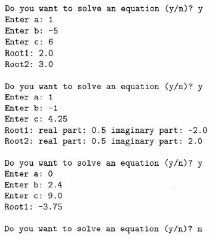

# **Quadratic Formula Calculator**
  
## Objective
---
 

- Write a program that will determine the roots of equations of the form `ax2 + bx + c = O`. The program should repeatedly prompt the user for values of a, b, and c. For each set of values, the program should solve the corresponding equation, if it has a solution, or print an appropriate message, if it has no solution. The program should be able to cope with coefficients that produce either real or complex roots. It should also be able to give appropriate results if one or more of the coefficients are equal to zero. The program should be interactive. The form of the exchange between a user and a computer is shown in the following example.

- 

- Has In.java
- Used Java version 1.2 ~~(*is updated though*)~~

  

***Made on February 24th, 2023***\
***By: Aaron Prince Anu***

*Temporary?*
